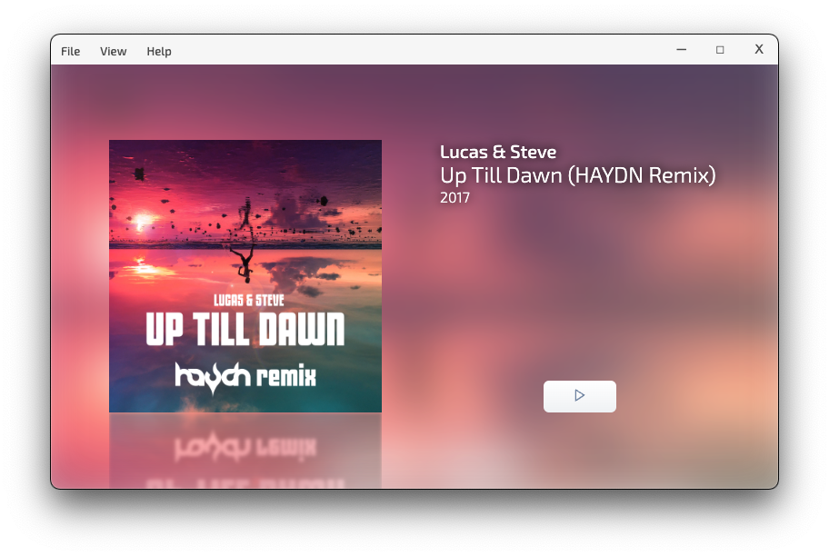

# Awesome Music Player - Demo App

This project serves the purpose of an exercise project for Electron development. It is based on the
[ERWT boilerplate](https://github.com/codesbiome/electron-react-webpack-typescript-2022) and has been highly customized.




## Prerequisites

- [NodeJS](https://nodejs.org/en/) must be installed
- [yarn](https://yarnpkg.com/) should be installed (or another package manager of your choice)

## Quick Start

First, close the demo project from GitHub:

```bash
git clone https://github.com/sdielmann/awesome-music-player-demo
```

Then, install dependencies using [pnpm](https://pnpm.io/) or [yarn](https://www.npmjs.com/package/yarn)
or [npm](https://www.npmjs.com/):

```bash
# or using yarn
yarn install

# or using npm
npm install

# using pnpm
pnpm install
```

For local development, just start the following script in the repository root. It will start the development mode of
[electron-forge](https://www.electronforge.io/):

```shell
yarn start
```

## Package : Production

Customize and package your Electron app with OS-specific bundles (.app, .exe etc)

```bash
yarn package
```

## Make : Production

Making is a way of taking your packaged application and making platform specific distributables like DMG, EXE, or
Flatpak files (amongst others).

```bash
yarn make
```

## Packager & Makers Configuration

This provides an easy way of configuring your packaged application and making platform specific distributables like DMG,
EXE, or Flatpak files.

This configurations file is available in :

```bash
tools/forge/forge.config.js
```

For further information, you can visit [Electron Forge Configuration](https://www.electronforge.io/configuration)
